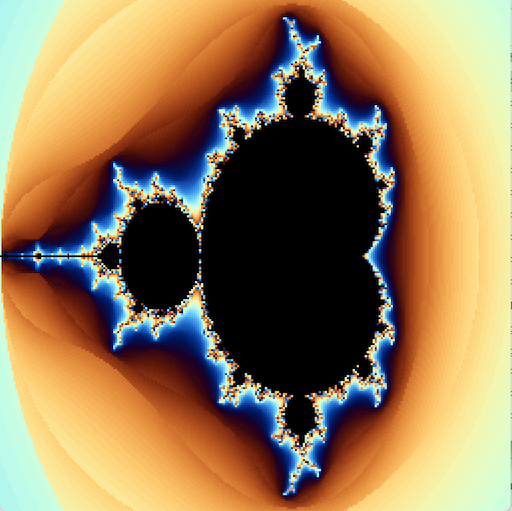
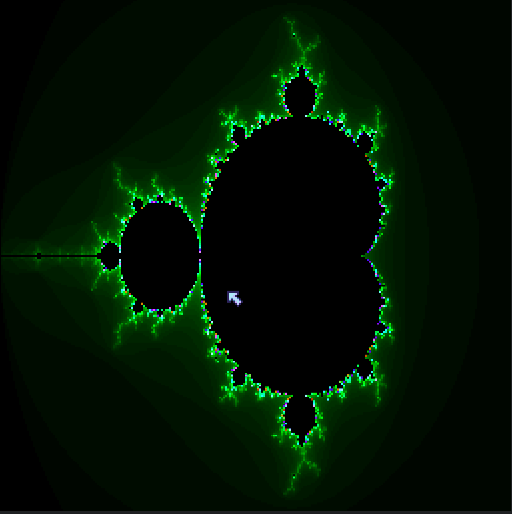
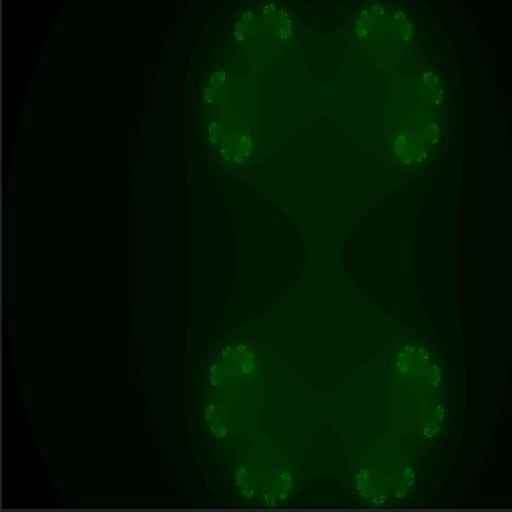
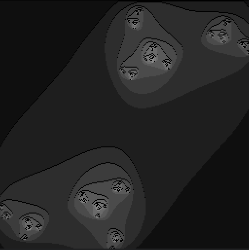

# mandelzoom2
タイトル：複数色マンデルブロート描画 ver2.0 
操作方法： 
　　マウスでカーソル位置を変更して 
　　マウスの左クリックで拡大 
　　マウスの右クリックで縮小 
　　Cキーでグラデカラーに切り替え 
　　Wキーでグラデカラーに切り替え 
　　Gキーでグレーカラーに切り替え 
　　1～9,0キーで深度切り替え 
　　Rキーで初期画面にもどる 
更新履歴  
2024.09.29 スムージング処理組み込み  
           グラデーションカラー追加  

- [mandelzoom2動作確認](https://sanbunnoichi1962.web.fc2.com/pyxel/mandelzoom2.html)

# mandelzoom
タイトル：複数色マンデルブロート描画 
操作方法： 
　　マウスでカーソル位置を変更して 
　　マウスの左クリックで拡大 
　　マウスの右クリックで縮小 
　　Cキーでグラデカラーに切り替え 
　　Gキーでグレーカラーに切り替え 
　　1～9,0キーで深度切り替え 
　　Rキーで初期画面にもどる 
更新履歴  
2024.09.20 data_ptrによる高速化対応追加  
 
Title: Multicolor Mandelbrot drawing  
How to operate:  
　Change the cursor position with the mouse  
　Right click mouse to enlarge  
　Zoom out with left mouse click  
　Switch to gradient color with C key  
　Switch to gray color with G key  
　Switch depth with 1-9,0 keys  
　Return to initial screen with R key  

- [mandelzoom動作確認](https://sanbunnoichi1962.web.fc2.com/pyxel/mandelzoom.html)

# juriaanim
タイトル：複数色ジュリアアニメーション  
操作方法： 
　マウスでカーソル位置を変更して 
　マウスの右クリック位置で始点仮設定 
　マウスの左クリック位置で終点設定 
　開始地点から終了地点までをループするアニメーション開始 
　Cキーでグラデカラーに切り替え 
　Gキーでグレーカラーに切り替え 
　Xキーで拡大 
　Yキーで縮小 
　1～9,0キーで深度切り替え 
更新履歴  
2024.09.20 data_ptrによる高速化対応追加  
 
計算処理に時間かかるのでマウス以外のキーは触らない方がいいかも 

- [juriaanim動作確認](https://sanbunnoichi1962.web.fc2.com/pyxel/juriaanim.html)

# fracanim
タイトル：フラクタルアニメーション  
　操作無しの見るだけアニメーション 

- [fracanim動作確認](https://sanbunnoichi1962.web.fc2.com/pyxel/fracanim.html)
