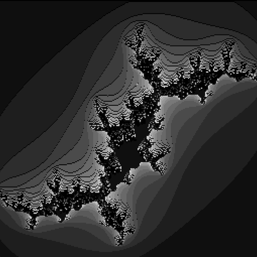
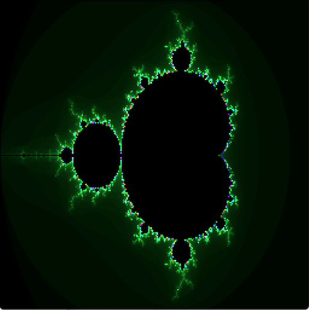

# fracanim （フラクタルアニメーション）
見るだけアニメーション 

# mandelzoom （マンデルブロート）
複数色対応第一弾 
マウスでカーソル位置を変更して 
マウスの左クリックで拡大 
マウスの右クリックで縮小 
Cキーでグラデカラーに切り替え 
Gキーでグレーカラーに切り替え 
1～0キーで深度切り替え 

# juriaanim （ジュリアアニメーション）
複数色対応第二弾 
マウスでカーソル位置を変更して 
マウスの右クリック位置で始点仮設定 
マウスの左クリック位置で終点設定 
開始地点から終了地点までをループするアニメーション開始 
Cキーでグラデカラーに切り替え 
Gキーでグレーカラーに切り替え 
Xキーで拡大 
Yキーで縮小 
1～0キーで深度切り替え 
 
計算処理に時間かかるのでマウス以外のキーは触らない方がいいかも 

