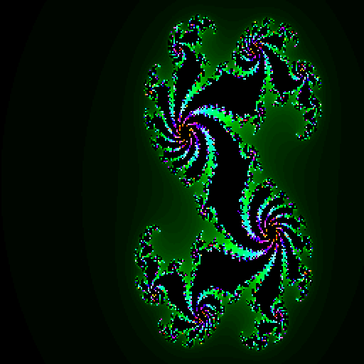

# juriaanim
Juria Animation

タイトル：複数色ジュリアアニメーション  
操作方法：  
　マウスでカーソル位置を変更して  
　マウスの右クリック位置で始点仮設定  
　マウスの左クリック位置で終点設定  
　開始地点から終了地点までをループするアニメーション開始  
　Cキーでグラデカラーに切り替え  
　Gキーでグレーカラーに切り替え  
　Xキーで拡大  
　Yキーで縮小  
　1～9,0キーで深度切り替え  
更新履歴  
2024.09.20 data_ptrによる高速化対応追加  
  
計算処理に時間かかるのでマウス以外のキーは触らない方がいいかも  

## スクリーンショット

