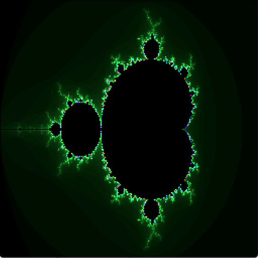
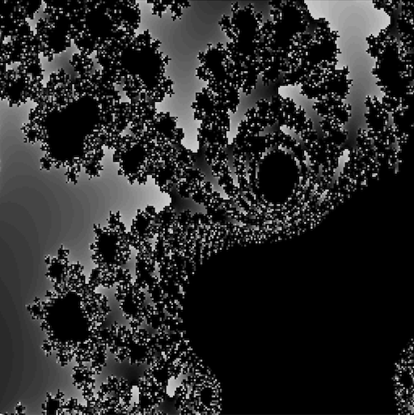

# mandelzoom
Multicolor Mandelbrot drawing
  
タイトル：複数色マンデルブロート描画  
操作方法：  
　　マウスでカーソル位置を変更して  
　　マウスの左クリックで拡大  
　　マウスの右クリックで縮小  
　　Cキーでグラデカラーに切り替え  
　　Gキーでグレーカラーに切り替え  
　　1～9,0キーで深度切り替え  
　　Rキーで初期画面にもどる  
更新履歴  
2024.09.20 data_ptrによる高速化対応追加  
  
Title: Multicolor Mandelbrot drawing  
How to operate:  
　Change the cursor position with the mouse  
　Right click mouse to enlarge  
　Zoom out with left mouse click  
　Switch to gradient color with C key  
　Switch to gray color with G key  
　Switch depth with 1-9,0 keys  
　Return to initial screen with R key  

## スクリーンショット

