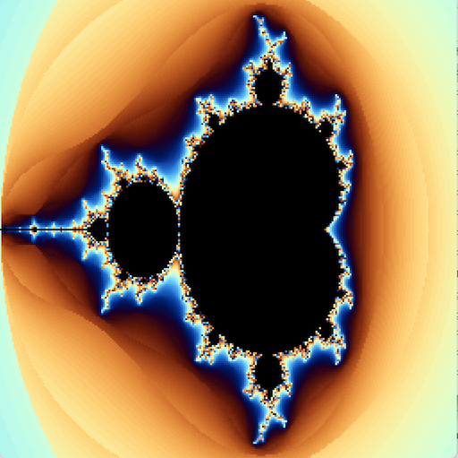
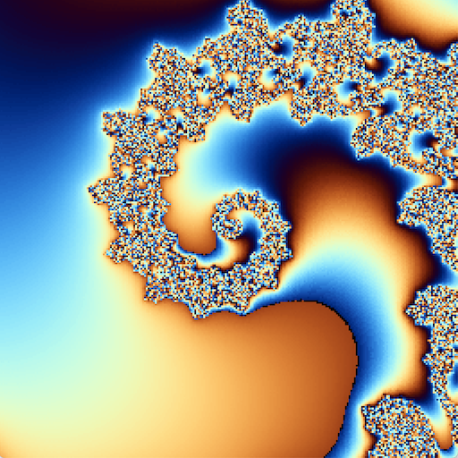
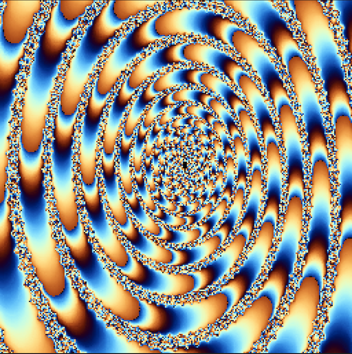
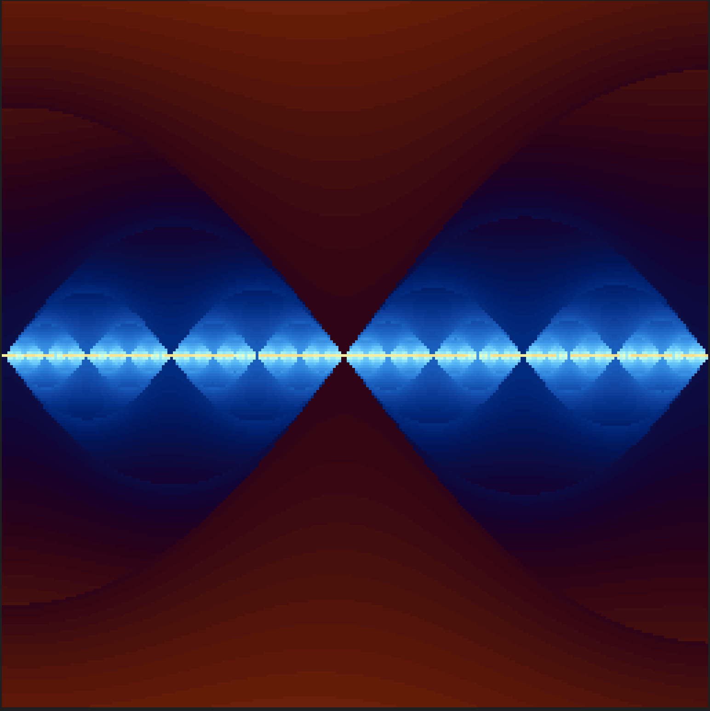

# mandelzoom2
Multicolor Mandelbrot drawing version 2.0

タイトル：複数色マンデルブロート描画 ver2.0  
操作方法：  
　　マウスでカーソル位置を変更して  
　　マウスの左クリックで拡大  
　　マウスの右クリックで縮小  
　　Cキーでグラデカラーに切り替え  
　　Wキーでグラデカラーに切り替え  
　　Gキーでグレーカラーに切り替え  
　　1～9,0キーで深度切り替え  
　　Rキーで初期画面にもどる  
更新履歴  
2024.09.29 スムージング処理組み込み  
グラデーションカラー追加  
  
## スクリーンショット

